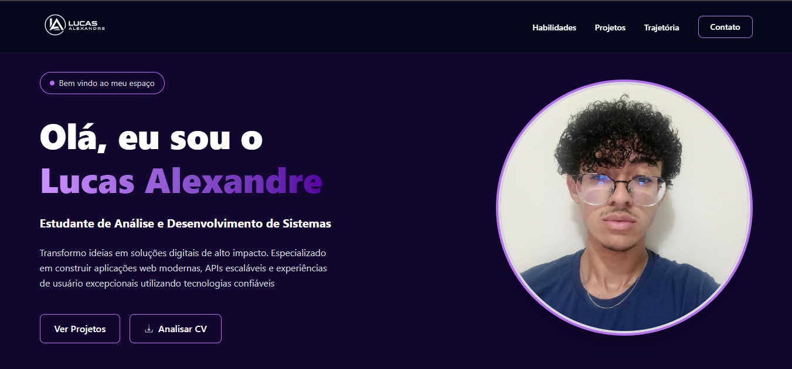
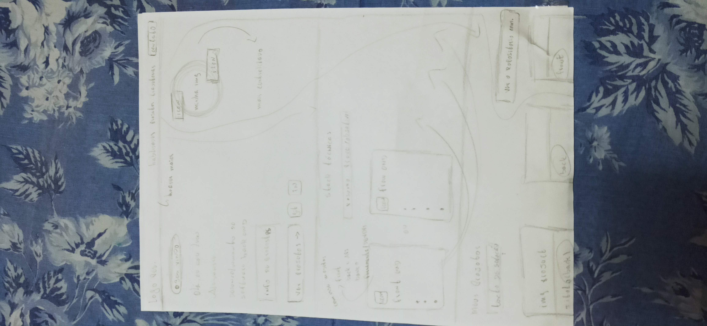
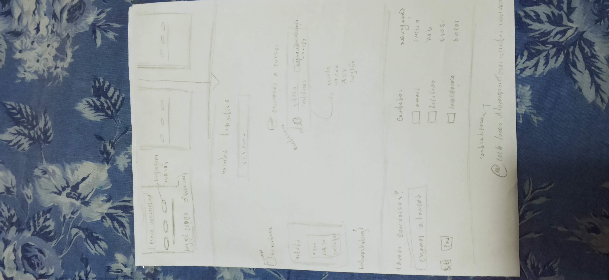

# PORTFÓLIO PROFISSIONAL WEB — LUCAS ALEXANDRE

<p align="center">
  
</p>

<p align="center">
  Aplicação Web desenvolvida para apresentação profissional, organização de projetos e demonstração de competências técnicas.
</p>

## Índice

- Introdução
- Descrição do Projeto
- Diagrama
- Design Figma
- Tecnologias Utilizadas
- Estrutura do Projeto
- Funcionalidades
- Deploy
- Desenvolvedor

## Introdução

O Portfólio Profissional Web foi desenvolvido com o objetivo de criar uma presença digital moderna, organizada e profissional, reunindo projetos, experiências, habilidades técnicas e informações de contato em uma única aplicação.

Além do desenvolvimento Front-End, o projeto também aplica conceitos de:

- Gestão de Projetos
- UX/UI
- Estruturação modular
- Organização de documentação
- Responsividade
- Planejamento técnico

O projeto funciona não apenas como uma página web, mas também como uma ferramenta de fortalecimento profissional e apresentação técnica.

## Descrição do Projeto

Aqui você encontra uma breve introdução sobre o projeto e sua finalidade.

O portfólio foi desenvolvido para servir como uma plataforma profissional capaz de apresentar projetos, competências técnicas, experiências acadêmicas e informações de contato de forma organizada e intuitiva.

Toda a aplicação foi planejada utilizando conceitos de estruturação visual, organização de componentes e experiência do usuário, visando criar uma navegação moderna, fluida e responsiva.

Antes do desenvolvimento da interface final, foram realizados processos de planejamento visual utilizando diagramas e prototipagem no Figma, permitindo uma visão clara da estrutura e do comportamento do sistema.

## Diagrama

O diagrama foi utilizado como base estrutural para o desenvolvimento do projeto, auxiliando na organização das seções, componentes e fluxo de navegação da aplicação.

A partir dele foi possível definir:

- Estrutura da página
- Organização das sessões
- Componentes principais
- Fluxo de navegação
- Hierarquia visual

## Design Figma

O design do projeto foi desenvolvido no Figma com o objetivo de estruturar visualmente toda a aplicação antes da implementação.

Os protótipos incluem:

- Baixa fidelidade
- Média fidelidade
- Alta fidelidade

O processo de prototipagem auxiliou diretamente na organização visual, definição de componentes e experiência do usuário.

### Acesse o Design

- Protótipo de Baixa Fidelidade

<p align="center">
  
  
</p>

- Protótipo de Média e Alta Fidelidade

[Figma](https://www.figma.com/design/CFiMrKUl2mDQZPXBPpusBl/Portfolio-Profissional?node-id=0-1&t=UNm84GSgK77ENVkn-1)

## Tecnologias Utilizadas

### Front-End
- HTML5
- TailwindCSS
- JavaScript

### Ferramentas
- Git
- GitHub
- GitHub Wiki
- GitHub Projects
- Figma
- Render

### Metodologias
- Mobile First
- Estrutura Modularizada
- Versionamento Git
- Organização por Milestones
- Planejamento baseado em TAP

## Estrutura do Projeto

```bash
portfolio-pessoal/
│
├── docs/
│   └── Curriculo_Lucas_Alexandre.pdf
│
├── img/
│
├── index.html
├── main.js
├── LICENSE
└── README.md
```

## Funcionalidades

- Layout moderno e responsivo
- Navegação fluida entre seções
- Sessão de habilidades técnicas
- Área de projetos desenvolvidos
- Sessão acadêmica e profissional
- Integração com GitHub e LinkedIn
- Responsividade para mobile, tablet e desktop
- Estrutura modularizada
- Deploy online da aplicação

## Deploy

A aplicação encontra-se publicada online utilizando a plataforma Render.

[Deploy](https://portfolio-pessoal-uiam.onrender.com/)

## Desenvolvedor

### Lucas Alexandre da Silva

Desenvolvedor Full Stack em formação pelo SENAI Jandira, com foco em desenvolvimento web, organização de projetos e construção de aplicações modernas e responsivas.

### Contato

[GitHub](https://github.com/LucasAlexandreDev)

[LinkedIn](https://linkedin.com/in/lucasalexandredev)

[E-mail](contato.lucasalexandre@gmail.com)

## Licença

Este projeto possui finalidade acadêmica e profissional, sendo utilizado como ferramenta de apresentação técnica e fortalecimento da marca pessoal.